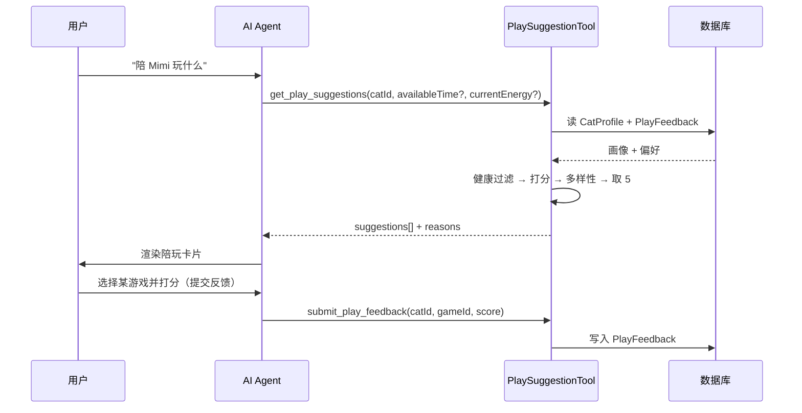
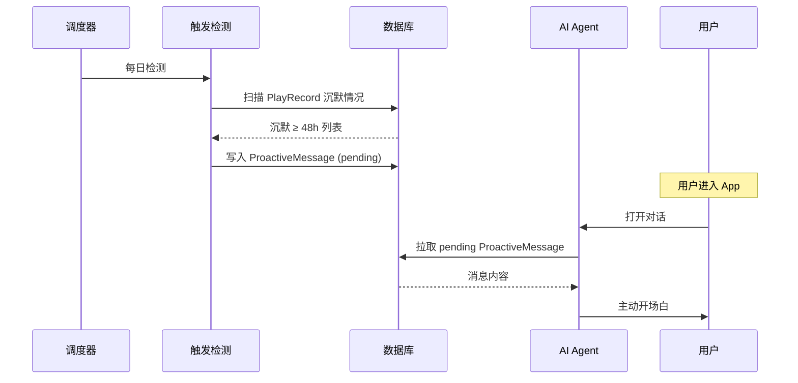

# AI 宠物陪玩教练（Pet Play Coach）- 需求文档（PRD）

| 项 | 值 |
|---|---|
| 文档版本 | v2.0.2 |
| 产品阶段 | MVP（P0）+ 后续迭代（P1/P2） |
| 适用平台 | 哈吉咪养成计划 - Web / PWA / Agent Framework |
| 关联技术文档 | [宠物陪玩功能技术设计.md](../02-开发/核心功能/宠物陪玩功能技术设计.md) |
| 上一版本 | v1.0（2026-06-15） |
| 更新时间 | 2026-06-15 |

---

## 0. 版本变更说明

### 0.1 v1.0 → v2.0

| 维度 | v1.0 | v2.0 |
|---|---|---|
| 产品定位 | 游戏推荐工具 | 个性化陪玩 Agent |
| 性格匹配 | 仅描述，无数据来源 | 明确建档录入 + Prisma 字段 |
| 推荐逻辑 | 取前 5 个 | 加权打分 + 多样性约束 + 健康禁忌硬过滤 |
| 偏好学习 | 无 | 反馈驱动的偏好画像（P1） |
| 主动服务 | 无 | 沉默提醒 / 运动不足 / 偏好发现（P2） |
| 数据闭环 | 无记录 | 推荐 → 反馈 → 学习 → 优化 闭环 |
| 成功指标 | 无 | 推荐采纳率 / 留存 / 满意度 |
| 健康安全 | 未涉及 | 健康禁忌矩阵作为硬过滤 |

### 0.2 v2.0 → v2.0.1（评审修订）

| 编号 | 问题 | 修订 |
| --- | --- | --- |
| A1 | §4.4.5 kitten 描述把 `catnip-toy` 误归 training 类 | 改为按 game id 描述：`catnip-toy` + `laser-chase` |
| A2 | §4.4.6 输出结构残留占位符 `"...其他游戏字段"` | 改为注释 `// ...其余 Game 字段透传` |
| A3 | §4.4.5 健康禁忌有"按 tag 规则"和"游戏自报"两套数据源 | 明确单一数据源 `game.contraindications`，规则在 seed 时展开 |
| A3 数据 | `feather-fishing` / `mouse-toy` 的 energyCost=4 应触发 senior 禁玩，原表漏标 | §4.3.3 表 contraindications 补 `senior` |
| B1 | 候选不足 5 个无规则 | §4.4.7(a) soft-fallback 三步放宽 |
| B2 | 双层降级未定义 | §4.4.7(c) L1 性格兜底 + L2 兽医提示 |
| B3 | `preferredCategory` 与健康过滤冲突优先级未定 | §4.4.7(b) 候选为空时自动降级为 +20 软加权 |
| R308-R310 | 边界规则缺对应需求点 | §4.4.9 补 R308/R309/R310 |

### 0.3 v2.0.1 → v2.0.2（spec 完整性补齐）

| 编号 | 问题 | 修订 |
| --- | --- | --- |
| C1 | §4.2 `energyBaseline` 只写"5 档滑块"，无档位文案 | §4.2.3 补档位描述表 + R105 |
| D4 | §4.4.1 场景推荐只举例 2 个，无完整枚举 | 补场景预设表 SC1-SC6 |
| D3 | §4.4.1 提到首页卡片入口但无对应需求点 | §4.4.9 补 R311 / R312 |
| D2 | §8.1 "用户满意度 = 反馈评分均值" 把游戏质量与功能满意度混在一起 | 拆为「游戏质量评分」(score 均值) + 「功能满意度」(NPS) |
| D1 | §8.1 D30 ≥ 35% 无基线对照方法论 | **待决**：上线后 T+30 用真实数据校准目标值 |
| D5 | US005 在基础用户故事但实现 F8 是 P2 | **待决**：用户故事保留，标注 P2 阶段 |
| 配套技术 | 技术设计 C2/C3/C4/C5 同步修订 | 见技术设计 §13.2 |

---

## 1. 需求背景

### 1.1 业务背景

宠物已逐渐从"宠物"演变为"家庭成员"，养宠人群对宠物心理与运动健康的关注度持续上升。常见问题：

- 缺乏互动的室内猫更易出现焦虑与刻板行为
- 运动不足直接增加肥胖风险
- 狩猎本能未被释放可能转化为破坏家具、攻击行为
- 高精力品种长期缺乏刺激易出现行为问题

> 数据声明：上述结论来自公开宠物行为学综述，本产品在向用户呈现"健康建议"时不直接引用未经审校的数字，所有专业建议在文案层均会标注"参考性建议，具体诊疗以兽医为准"。

当前主人主要依赖社交媒体、宠物博主推荐和自行摸索，缺乏 **科学 + 个性化** 的陪玩指导。

### 1.2 用户痛点

| 编号 | 痛点描述 | 影响人群 | 严重度 |
|---|---|---|---|
| P01 | 不知道每天该陪猫咪玩多久 | 全部 | 高 |
| P02 | 游戏创意枯竭，玩法单一 | 新手 | 中 |
| P03 | 不清楚猫咪喜好，游戏不对胃口 | 全部 | 高 |
| P04 | 忙碌时无法定时陪玩 | 上班族 | 高 |
| P05 | 担心运动量不足导致肥胖 | 老年/室内猫主人 | 高 |
| P06 | 多猫家庭差异大，需要个性化推荐 | 多猫家庭 | 中 |

### 1.3 产品定位

| 项 | 内容 |
|---|---|
| 产品名称 | Pet Play Coach（宠物陪玩教练） |
| 一句话定位 | 基于宠物画像与行为反馈，为主人提供个性化陪玩方案的 AI Agent |
| 产品愿景 | 让每只宠物都拥有适合自己的运动与互动计划 |
| 与现有产品关系 | 作为「哈吉咪养成计划」的核心 Agent 工具之一，与 Cat Info / Health Check 等工具协同工作 |

### 1.4 不做的事（Non-Goals）

明确划出本期不做：

- ❌ 不做实时视频陪玩 / 摄像头陪伴
- ❌ 不做硬件玩具控制（激光笔、自动逗猫器联动）
- ❌ 不做用户原创游戏上传（仅系统内置游戏库）
- ❌ 不做社交分享 / 排行榜
- ❌ 不替代兽医诊断，不输出医疗建议

---

## 2. 用户分析

### 2.1 目标用户画像

| 用户类型 | 占比 | 关键特点 | 核心需求 |
|---|---|---|---|
| 新手养猫用户 | 40% | 缺乏养宠经验，不懂行为学 | 标准化指导、零门槛上手 |
| 上班族 | 35% | 时间有限，碎片化陪玩 | 高效短时方案、自动提醒 |
| 多宠家庭 | 15% | 宠物差异明显 | 按宠物个性化推荐 |
| 高参与养宠用户 | 10% | 重视宠物健康，愿意长期记录 | 数据沉淀、周报分析 |

### 2.2 核心用户故事

| 编号 | 角色 | 用户故事 | 验收标准 |
|---|---|---|---|
| US001 | 新手用户 | 我想知道今天该陪猫咪玩什么 | 系统返回 3-5 个推荐，含玩法说明、时长、所需道具 |
| US002 | 上班族 | 我只有 10 分钟，想找合适的游戏 | 推荐结果时长全部 ≤ 10 分钟，且按匹配度排序 |
| US003 | 多猫家庭 | 我想为不同性格的猫推荐不同游戏 | 切换猫咪后推荐结果显著不同 |
| US004 | 主人 | 我想记录每次陪玩并打分 | 卡片支持一键记录 + 1-5 星打分 |
| US005 | 忙碌主人 | 我希望长时间没陪猫时能被提醒 | 沉默 ≥ 48h 后下次进入 App 收到主动提醒 |
| US006 | 高参与用户 | 我想看每周的陪玩报告 | 系统生成包含总时长、最爱游戏、改进建议的周报 |

---

## 3. 产品架构与数据闭环

### 3.1 信息架构

```text
Pet Play Coach
├── 宠物档案（personality / energyBaseline / healthTags）
├── 游戏库（系统内置，10+ 款）
├── 智能推荐
│   ├── 对话式推荐（用户提问触发，主入口）
│   ├── 快速推荐（首页卡片入口，无需对话）
│   └── 场景推荐（按"我只有 X 分钟""猫很累"等场景）
├── 陪玩反馈（评分 + 完成情况）
├── 陪玩记录（自动 + 手动）
├── 偏好学习（反馈驱动）
├── 主动服务（沉默提醒 / 运动不足提醒 / 偏好发现）
└── 周报分析
```

### 3.2 核心数据闭环

```text
建立宠物档案
       ↓
       智能推荐（基于画像 + 偏好）
       ↓
       用户采纳（点击 / 开始陪玩）
       ↓
       记录陪玩 + 提交反馈
       ↓
       偏好学习（更新画像）
       ↓
       下一次推荐质量提升
       ↓
       主动服务（沉默 / 异常时介入）
       ↓
       周报输出（持续陪伴）
```

**设计原则**：闭环每一环都有 P0 兜底，**不依赖偏好数据也能跑出合理推荐**（冷启动友好）。

---

## 4. 功能需求

### 4.1 功能模块总览

| 模块 | 功能说明 | 关联痛点 | 优先级 |
|---|---|---|---|
| F1 宠物画像 | 性格 / 精力档位 / 健康标签 | P03、P06 | P0 |
| F2 游戏库 | 10+ 系统内置游戏 | P02 | P0 |
| F3 智能推荐 | 加权打分 + 健康禁忌过滤 | P01-P03、P05 | P0 |
| F4 陪玩反馈 | 1-5 星评分 + 完成情况 | P03 | P0 |
| F5 陪玩记录 | 时长 + 游戏类型记录 | P04、P05 | P1 |
| F6 偏好学习 | 反馈驱动的画像更新 | P03 | P1 |
| F7 周报分析 | 周陪玩数据汇总与建议 | P05 | P1 |
| F8 主动提醒 | 沉默 / 运动不足提醒 | P04 | P2 |
| F9 偏好发现 | 系统主动告知发现的偏好 | P03 | P2 |

### 4.2 F1 宠物画像

#### 4.2.1 字段定义

| 字段 | 类型 | 必填 | 录入方式 | 说明 |
|---|---|---|---|---|
| personality | enum | 是 | 建档时 4 选 1（带说明卡片） | active / curious / clingy / aloof |
| energyBaseline | int(1-5) | 是 | 建档时 5 档滑块 + 文字描述辅助选择 | 静息精力档位，作为推荐默认值 |
| healthTags | enum[] | 否 | 建档时多选 + 后续可在档案页编辑 | overweight / senior / post_op / kitten |

> 性格 4 类参考自经典猫咪行为学分类（Feline Five 简化版）。建档页配文字+图示帮助主人选择，避免误判。

#### 4.2.2 性格分类（用户视角）

| 性格 | 描述（给用户看） | 典型表现 | 推荐倾向 |
|---|---|---|---|
| 活泼好动型（active） | 精力旺盛，喜欢追逐奔跑 | 经常飞奔、扑咬、撕咬玩具 | 追逐、狩猎类 |
| 聪明好奇型（curious） | 喜欢探索，善于解谜 | 爱开柜门、研究新物品 | 益智、攀爬类 |
| 黏人互动型（clingy） | 依赖主人，喜欢被关注 | 跟随主人、爱被抚摸 | 互动、训练类 |
| 高冷独立型（aloof） | 喜欢独处，选择性互动 | 喜欢独自待着、不爱被打扰 | 独处、狩猎类 |

#### 4.2.3 精力档位描述（用户视角）

建档时通过 5 档滑块选择 `energyBaseline`，每档配文字辅助判断：

| 档位 | 名称 | 用户视角描述 | 典型表现 |
|---|---|---|---|
| 1 | 极低 | 多数时间在睡觉 | 几乎不主动活动，只在进食/如厕时移动 |
| 2 | 偏低 | 喜欢趴卧 | 偶尔短暂玩耍，几分钟内就躺下 |
| 3 | 中等 | 日常活动正常 | 每天主动玩耍数次，每次 5-10 分钟 |
| 4 | 偏高 | 经常跑动 | 对玩具反应强烈，主动发起玩耍 |
| 5 | 极高 | 几乎停不下来 | 需要大量运动消耗，否则出现破坏行为 |

> 该字段作为推荐默认 `currentEnergy`，用户每次提问时可显式覆盖。老年猫默认建议 1-2，成年猫 3-4，幼猫 4-5（仅作为建档引导提示，不强制）。

#### 4.2.4 需求点

| 需求点 | 描述 | 优先级 |
|---|---|---|
| R101 | 建档流程必须收集 personality + energyBaseline | P0 |
| R102 | healthTags 可选，可在档案页二次编辑 | P0 |
| R103 | 老用户首次进入陪玩功能时引导补全画像 | P0 |
| R104 | 画像字段对所有 Agent Tool 共享（不仅陪玩） | P0 |
| R105 | 建档页必须为 personality / energyBaseline 提供文字+图示辅助判断（避免误判） | P0 |

### 4.3 F2 游戏库

#### 4.3.1 数据结构（PRD 视角）

每个游戏包含以下字段（结构化存储，非自由文本）：

| 字段 | 说明 | 示例 |
|---|---|---|
| id | 唯一标识 | `feather-fishing` |
| name | 游戏名称 | 羽毛钓鱼 |
| category | 类别 | hunting |
| difficulty | 难度（用户视角） | easy / medium / hard |
| durationMin | 标准时长（分钟，单值） | 10 |
| energyCost | 强度档位 1-5 | 4 |
| requiredProps | 所需道具 | ["羽毛逗猫棒"] |
| benefits | 好处标签 | ["反应训练", "狩猎模拟"] |
| fitsPersonality | 匹配性格 | ["active", "aloof"] |
| contraindications | 健康禁忌 | ["post_op"] |
| description | 玩法说明 | 用羽毛模拟鸟类飞行轨迹… |
| tips | 小贴士 | 结束时用零食奖励 |

#### 4.3.2 类别枚举

固定 6 类，前后端共享：

```
chase（追逐） / hunting（狩猎） / puzzle（益智）
interaction（互动） / climbing（攀爬） / solo（独处）
```

> v1 中"高处瞭望"标为 puzzle 是错误，v2 修正为 climbing 类，并补全 climbing 枚举。

#### 4.3.3 首批游戏库（10 款）

| ID | 名称 | 类别 | 难度 | 时长(分) | 强度 | 匹配性格 | 禁忌 |
| --- | --- | --- | --- | --- | --- | --- | --- |
| laser-chase | 激光追逐 | chase | easy | 8 | 5 | active | senior, post_op, kitten |
| feather-fishing | 羽毛钓鱼 | hunting | easy | 10 | 4 | active, aloof | senior, post_op |
| food-puzzle | 食物谜题 | puzzle | medium | 15 | 2 | curious | — |
| hide-seek | 藏猫猫 | interaction | easy | 5 | 2 | clingy | — |
| tunnel-explore | 猫隧道探险 | chase | easy | 10 | 3 | active, curious | — |
| mouse-toy | 逗猫老鼠 | hunting | easy | 10 | 4 | active, aloof | senior, post_op |
| high-perch | 高处瞭望 | climbing | medium | 10 | 2 | curious | senior, post_op |
| crinkle-chase | 响纸追逐 | chase | easy | 5 | 3 | active | post_op |
| training-handshake | 训练握手 | interaction | medium | 5 | 1 | clingy, curious | — |
| catnip-toy | 猫薄荷玩具 | solo | easy | 10 | 2 | aloof | kitten（< 6 个月） |

> 所有游戏内容由产品团队梳理，未来引入兽医顾问审校后会在每条游戏上挂"已审校"标记。本期不展示该标记。

#### 4.3.4 需求点

| 需求点 | 描述 | 优先级 |
|---|---|---|
| R201 | 游戏库以代码常量 / 数据库 seed 形式存在，用户不可编辑 | P0 |
| R202 | 游戏库变更需走版本发布，所有字段不可缺省 | P0 |
| R203 | 后续新增游戏时必须填齐 fitsPersonality / contraindications | P0 |

### 4.4 F3 智能推荐（核心）

#### 4.4.1 推荐入口

| 入口 | 触发方式 | 入参来源 |
|---|---|---|
| 对话式 | 用户向 AI 提问"陪 Mimi 玩什么" | LLM 解析对话获得 availableTime / currentEnergy 等 |
| 快速推荐 | 首页"今日陪玩"卡片 | 默认 availableTime=10, currentEnergy=energyBaseline |
| 场景推荐 | 用户选择"我只有 5 分钟"等预设场景 | 场景预设固定参数（见下表） |

**场景预设清单**（前端展示为快捷按钮，可扩展）：

| 场景 ID | 用户表达 | 预设参数 |
|---|---|---|
| SC1 | "我只有 5 分钟" | `availableTime=5` |
| SC2 | "我只有 10 分钟" | `availableTime=10` |
| SC3 | "Mimi 精力很旺盛" | `currentEnergy=5` |
| SC4 | "Mimi 有点累" | `currentEnergy=2` |
| SC5 | "想玩追逐类" | `preferredCategory=chase` |
| SC6 | "想玩益智类" | `preferredCategory=puzzle` |

> 场景预设仅为入参便利通道，最终仍走完整推荐流程（健康过滤 + 打分 + 多样性 + 降级）。用户也可在对话里自由表达，LLM 解析为相同入参。

#### 4.4.2 输入参数

| 参数 | 类型 | 必填 | 缺省值 | 说明 |
|---|---|---|---|---|
| catId | string | 是 | — | 默认猫咪可由系统选取 |
| availableTime | number | 否 | 10（分钟） | 可用时间 |
| currentEnergy | int(1-5) | 否 | cat.energyBaseline | 当前精力 |
| preferredCategory | enum | 否 | — | 用户显式指定的类别 |

#### 4.4.3 推荐流程

```text
1. 取宠物画像（personality / energyBaseline / healthTags）
2. 健康禁忌硬过滤（详见 §4.4.5）
3. 显式偏好硬过滤（如指定 preferredCategory）
4. 对每个候选游戏计算 4 个子分数：
     PersonalityScore（35%）
     EnergyScore（25%）
     TimeScore（20%）
     PreferenceScore（20%）
5. 加权得到 0-100 总分
6. 按分数降序排列
7. 多样性约束：同 category 最多保留 2 个
8. 取前 5 个返回
9. 若结果为空 → 触发降级推荐（忽略时间与精力，按性格 + 健康过滤）
```

> **算法细则（子分数公式、阈值）由 [技术设计文档](../02-开发/核心功能/宠物陪玩功能技术设计.md) 定义**。本 PRD 仅约束输入、输出、权重和降级策略。

#### 4.4.4 推荐权重

| 维度 | 权重 | 产品理由 |
|---|---|---|
| 性格匹配 | 35% | 性格是最稳定的特征，影响最大 |
| 精力匹配 | 25% | 精力影响"当下"是否合适，第二重要 |
| 时间匹配 | 20% | 时间是硬约束，但游戏时长本身有弹性 |
| 历史偏好 | 20% | 冷启动期数据少，权重不宜过高 |

#### 4.4.5 健康禁忌矩阵（硬过滤）

| healthTag | 禁忌策略（产品规则） |
|---|---|
| overweight | **不过滤**，但推荐时优先 energyCost ≥ 3 的游戏（鼓励运动） |
| senior（≥ 10 岁） | 禁玩 energyCost ≥ 4 的所有游戏（高强度对老年猫危险） |
| post_op（术后 30 天内） | 禁玩 energyCost ≥ 3 的所有游戏（避免拉扯伤口） |
| kitten（< 6 个月） | 禁玩 `catnip-toy`（猫薄荷，< 6 月龄神经未发育完全）+ `laser-chase`（眼部敏感） |

> **数据源单一化（v2.0 修正）**：上述规则在游戏入库时**一次性展开**写入每条游戏的 `contraindications` 字段（见 §4.3.3 表），运行时**只读 `game.contraindications` 一个字段**，不再同时存在"按 tag 批量规则"和"游戏自报"两套数据源，避免调优时改一处漏一处。
>
> 健康禁忌是**硬过滤**，不论分数多高都不出现，确保安全兜底。

#### 4.4.6 输出结构

```json
{
  "success": true,
  "suggestions": [
    {
      "id": "feather-fishing",
      "name": "羽毛钓鱼",
      "score": 92,
      "scoreBreakdown": {
        "personality": 100,
        "energy": 75,
        "time": 100,
        "preference": 60
      },
      "reasons": ["匹配活泼好动性格", "刚好 10 分钟", "时间充裕"]
      // ...其余 Game 字段（category / durationMin / requiredProps 等）按 §4.3.1 透传
    }
  ],
  "fallback": false
}
```

#### 4.4.7 边界规则（v2.0 新增）

针对推荐结果在多重过滤下出现候选不足的情况，定义三层兜底：

##### (a) 候选不足时的 soft-fallback

打分 + 多样性约束后，若结果条数 < 3，按下列顺序**逐步放宽**，直到 ≥ 3 或全部放宽完为止：

| 步骤 | 放宽动作 |
|---|---|
| 1 | 多样性约束 `maxPerCategory` 从 2 提到 3 |
| 2 | 若用户指定了 `preferredCategory`，改为软加权（该类别 +20 分 bonus），不再硬过滤 |
| 3 | 放宽 `availableTime` 约束 ±50%（5 分钟 → 接受 2.5-7.5 分钟） |

> 放宽过程中**健康禁忌永不放宽**。

##### (b) preferredCategory 软加权（与硬过滤的关系）

- 默认行为：`preferredCategory` 作为硬过滤（用户明说要某类，就只在该类里选）。
- 当且仅当硬过滤后候选 < 1 时，**自动降级为软加权**：原类别 +20 分 bonus，让其他类别的游戏有机会进入结果。前端在该场景下展示"已为你扩大范围"提示。

##### (c) 双层降级

| 层级 | 触发条件 | 行为 |
|---|---|---|
| L1 降级 | 打分 + 多样性 + soft-fallback 后结果仍为 0 | 调用 `fallbackRecommend`：忽略 currentEnergy/availableTime，仅按性格 + 健康过滤取 3 条 |
| L2 降级 | L1 也返回空（极端：所有游戏被健康过滤） | 返回 `success: false, message: '当前健康标签下暂无合适游戏，建议咨询兽医'` |

**降级时的前端展示规则**：

| 状态 | 展示 |
|---|---|
| `fallback: false` | 正常展示 score 与 reasons |
| `fallback: true`（L1） | **不展示 score**，改展示一句中性文案"按 {性格} 偏好为你挑选" |
| `success: false`（L2） | 展示空状态卡片 + 咨询兽医引导 |

> 降级状态通过 `fallback` / `success` 字段传给前端；**reasons 字段在降级时使用产品文案，不含"降级""未匹配"等开发者术语**，避免被 LLM 复述给用户。

#### 4.4.8 推荐解释（reasons）

`reasons` 由后端基于子分数和阈值**确定性生成**，不由 LLM 编造：

| 触发条件 | 解释文案 |
|---|---|
| PersonalityScore = 100 | "匹配 {性格中文名} 性格" |
| EnergyScore = 100 | "精力档位完全匹配" |
| EnergyScore ≥ 75 | "精力档位接近" |
| TimeScore = 100 | "刚好 {availableTime} 分钟" |
| PreferenceScore ≥ 75 且数据 ≥ 2 次 | "{猫名}之前很喜欢" |

#### 4.4.9 需求点

| 需求点 | 描述 | 优先级 |
|---|---|---|
| R301 | 推荐结果一次最多 5 条 | P0 |
| R302 | 结果必须包含 score 与 reasons | P0 |
| R303 | 同 category 最多 2 条（多样性） | P0 |
| R304 | 结果为空时必须触发降级（L1 + L2） | P0 |
| R305 | 健康禁忌过滤 100% 生效，不可旁路 | P0 |
| R306 | 冷启动（无偏好数据）时推荐质量不显著下降 | P0 |
| R307 | preferredCategory 默认硬过滤，候选为空时自动降级为软加权（+20 bonus） | P0 |
| R308 | 候选 < 3 时触发 soft-fallback（多样性放宽 → preferredCategory 软化 → 时间放宽） | P0 |
| R309 | 降级时 reasons 使用产品文案，禁止"降级""未匹配"等开发者术语 | P0 |
| R310 | 健康禁忌数据源单一为 `game.contraindications`，禁止多源 | P0 |
| R311 | 首页提供"今日陪玩"卡片入口，一键触发快速推荐（无需进入对话） | P0 |
| R312 | 提供至少 6 个场景预设快捷按钮（见 §4.4.1 场景清单） | P0 |

### 4.5 F4 陪玩反馈（P0）

> 反馈是偏好学习的输入，**P0 必须采集，但 P0 不必学习**——确保 P1 上线时已有数据可用，避免再一次冷启动。

#### 4.5.1 反馈数据结构

| 字段 | 类型 | 说明 |
|---|---|---|
| catId | string | 关联猫咪 |
| gameId | string | 关联游戏 |
| score | int(1-5) | 兴趣评分 |
| completion | bool | 是否完成（玩满建议时长） |
| actualDuration | number | 实际时长（分钟，可选） |
| playedAt | datetime | 时间 |

#### 4.5.2 评分含义

| 分数 | 含义 |
|---|---|
| 1 | 完全无兴趣（看都不看） |
| 2 | 兴趣较低（玩两下就走） |
| 3 | 一般 |
| 4 | 喜欢 |
| 5 | 非常喜欢（停不下来） |

#### 4.5.3 交互形态

- 推荐卡片底部固定"打分"行（5 个星星 + 完成 toggle）。
- **打分非强制**：未打分不阻断流程，但下次同游戏推荐时会提示"上次玩了没打分"。
- 打分提交后写入 `PlayFeedback` 表。

#### 4.5.4 需求点

| 需求点 | 描述 | 优先级 |
|---|---|---|
| R401 | 推荐卡片必须支持打分入口 | P0 |
| R402 | 打分非必填，跳过不阻断 | P0 |
| R403 | 同一 (catId, gameId, playedAt 当天) 仅保留最新一次 | P0 |

### 4.6 F5 陪玩记录（P1）

| 需求点 | 描述 | 优先级 |
|---|---|---|
| R501 | 用户开始陪玩时可一键创建记录 | P1 |
| R502 | 记录包含 catId / gameId / duration / playedAt | P1 |
| R503 | 列表页按时间倒序展示 | P1 |
| R504 | 支持手动补录（昨天忘了记） | P1 |

### 4.7 F6 偏好学习（P1）

#### 4.7.1 学习对象

- **游戏级偏好**：单个游戏的累计评分均值、次数。
- **类别级偏好**：单个 category 的累计评分均值、次数。

#### 4.7.2 学习规则

| 触发条件 | 行为 |
|---|---|
| 同一游戏评分 ≥ 4 累计 3 次 | PreferenceScore 给该游戏满分加成 |
| 同一游戏评分 ≤ 2 累计 3 次 | 该游戏从主推中淘汰，仅在用户显式询问时出现 |
| 同一类别评分 ≥ 4 累计 5 次 | 该类别在 PreferenceScore 中获得整体提升 |

> 具体公式见技术设计文档。PRD 仅约束规则的"产品意图"。

#### 4.7.3 需求点

| 需求点 | 描述 | 优先级 |
|---|---|---|
| R601 | 偏好画像每次推荐前实时计算（或由后端缓存） | P1 |
| R602 | 偏好画像可在档案页查看（哪些游戏喜欢/不喜欢） | P1 |
| R603 | 用户可手动重置偏好 | P1 |

### 4.8 F7 周报分析（P1）

#### 4.8.1 周报内容

| 模块 | 内容 |
|---|---|
| 总览 | 本周陪玩总时长、次数、对比上周 |
| 最爱游戏 | 本周评分最高的游戏 Top 3 |
| 类别分布 | 各类别的时长占比饼图 |
| 改进建议 | 基于数据的轻量建议（如"益智类偏少，建议增加"） |

#### 4.8.2 需求点

| 需求点 | 描述 | 优先级 |
|---|---|---|
| R701 | 每周一生成上周周报 | P1 |
| R702 | 用户主动询问"周报"时由 Agent Tool 返回 | P1 |
| R703 | 周报内容由后端预生成，工具读快照 | P1 |

### 4.9 F8 主动提醒（P2）

#### 4.9.1 触发场景

| 场景 | 触发条件 | 文案模板 |
|---|---|---|
| 沉默提醒 | 同一猫咪 ≥ 48h 无陪玩记录 | "{猫名}已经两天没有记录陪玩了，今天安排 10 分钟羽毛钓鱼？" |
| 运动不足 | 本周陪玩总时长较上周下降 ≥ 40% | "本周陪玩比上周少了 40%，建议加点追逐类游戏" |
| 偏好发现 | 同类别评分 ≥ 4 累计 5 次（首次达成） | "{猫名}最近特别喜欢狩猎类游戏，要不要试试逗猫老鼠？" |

#### 4.9.2 触发与呈现机制

| 项 | 方式 |
|---|---|
| 检测频率 | 后端 Scheduler 每日 1 次（凌晨低峰） |
| 检测产物 | 写入 `ProactiveMessage` 表，状态为 pending |
| 呈现时机 | 用户**下次打开 App / 进入 Agent 对话**时拉取并展示 |
| 呈现形式 | Agent 主动开场白（不依赖浏览器 Push） |
| 退化方案 | PWA Push 失败 / 未授权时仍能通过对话开场白送达 |

> **本期不依赖浏览器 Push**，避免 PWA Push 在国内环境的可用性问题。

#### 4.9.3 需求点

| 需求点 | 描述 | 优先级 |
|---|---|---|
| R801 | Scheduler 每日检测一次，可配置时间 | P2 |
| R802 | 同一类型提醒同一猫咪 24h 内仅推送 1 次 | P2 |
| R803 | 用户可在设置中关闭主动提醒 | P2 |
| R804 | 主动提醒文案模板可配置（不写死代码） | P2 |

### 4.10 F9 偏好发现（P2）

合并在 F8 中作为一种主动提醒类型，不单独列模块。

---

## 5. 非功能需求

| 类型 | 指标 | 验证方式 |
|---|---|---|
| 工具执行性能 | PlaySuggestionTool 内部耗时 ≤ 50ms（不含 LLM） | 后端日志统计 |
| 端到端响应 | 用户提问 → 卡片渲染完成 P95 ≤ 5s | 前端埋点 |
| 数据完整性 | 游戏库每条数据 12 个字段 100% 完整 | 启动时校验 schema |
| 推荐健康性 | 健康禁忌过滤命中率 100% | 单元测试 + 线上审计 |
| 推荐多样性 | 同 category 在结果中 ≤ 2 条 | 单元测试 |
| 兼容性 | Web / PWA / 移动端 | 三端 UI 自测 |

> v1 的 "≤ 200ms" 是工具内部耗时口径，v2 显式区分了"工具耗时"与"端到端响应"。

---

## 6. 用户交互流程

### 6.1 主流程：对话式推荐



### 6.2 主动服务流程



---

## 7. 埋点设计

### 7.1 事件清单

| 事件名 | 触发时机 | 关键属性 |
|---|---|---|
| recommendation_view | 推荐卡片渲染完成 | catId, source(chat/quick/scenario), gameIds[], scores[] |
| recommendation_click | 用户点击某条推荐 | catId, gameId, position, score |
| play_start | 用户点"开始陪玩" | catId, gameId, source |
| play_complete | 用户标记"完成" | catId, gameId, actualDuration |
| feedback_submit | 提交评分 | catId, gameId, score, completion |
| proactive_show | 主动消息呈现 | catId, type(silent/lowActivity/discovery) |
| proactive_click | 用户点击主动消息 CTA | catId, type, gameId |

### 7.2 关键漏斗

```
recommendation_view → recommendation_click → play_start → play_complete → feedback_submit
```

每一步对应一个核心指标。

---

## 8. 成功指标

### 8.1 指标定义（必须明确口径）

| 指标 | 口径 | 目标值 |
|---|---|---|
| 推荐点击率 | recommendation_click 数 / recommendation_view 数（去重 catId+session） | > 50% |
| 推荐采纳率 | play_start 数 / recommendation_view 数 | > 40% |
| 完成率 | play_complete 数 / play_start 数 | > 70% |
| 反馈率 | feedback_submit 数 / play_complete 数 | > 30% |
| 周活跃率（功能内） | 每周使用陪玩功能 ≥ 1 次的用户占比 | > 50% |
| D30 留存（功能） | 首次使用后 30 天内再次使用占比 | ≥ 35% |
| 平均陪玩次数 | 周活用户平均每周陪玩次数 | ≥ 5 |
| 游戏质量评分 | PlayFeedback.score 均值（衡量推荐结果与猫偏好的匹配度，按 catId+gameId 去重） | ≥ 4.0 |
| 功能满意度 | 季度问卷调研 NPS（站内信触达） | ≥ 30 |
| 健康禁忌违规率 | 推荐结果中违反禁忌的次数 / 总推荐次数 | = 0% |

### 8.2 指标分级

- **北极星指标**：周活用户平均陪玩次数（≥ 5 次/周）
- **健康度指标**：推荐采纳率、反馈率
- **体验指标**：游戏质量评分（≥ 4.0，反映推荐结果与猫偏好的匹配度）
- **质量底线**：健康禁忌违规率（必须 = 0）

> 游戏质量评分（PlayFeedback 均值）与功能满意度（问卷 NPS）分开度量：前者衡量推荐准不准，后者衡量整体产品体验。两者不可互相替代。

---

## 9. MVP 拆分

### 9.1 P0（首发必做）

- F1 宠物画像（含 personality / energyBaseline / healthTags）
- F2 游戏库（10 款）
- F3 智能推荐（含打分公式、健康禁忌、多样性、降级、解释）
- F4 陪玩反馈采集（**采集但不学习**）
- 埋点 1-5（recommendation_view / click / play_start / complete / feedback_submit）

### 9.2 P1

- F5 陪玩记录
- F6 偏好学习（启用 PreferenceScore 真实计算）
- F7 周报

### 9.3 P2

- F8 主动提醒
- F9 偏好发现（合并在 F8）
- 多宠协同推荐（多猫家庭一次推荐多套方案）

---

## 10. 风险与开放问题

| 项 | 风险 | 缓解措施 |
| --- | --- | --- |
| R1 | 游戏库内容缺乏权威性背书 | 后续引入兽医顾问审校机制；当前文案标注"参考性建议" |
| R2 | 性格分类用户自评不准 | 提供描述卡 + 图示 + 后续可改；偏好学习可逐步纠偏 |
| R3 | PWA Push 在国内环境受限 | 主动服务以"对话开场白"为主通道，不强依赖 Push |
| R4 | 偏好数据冷启动期质量不高 | PreferenceScore 在无数据时取中性 60，不主导推荐 |
| R5 | LLM 解析对话获得参数不稳定 | 工具入参全部可选，缺省时使用画像默认值 |
| O1 | 是否引入"狗"等其他物种 | 本期仅猫，物种字段保留扩展位 |
| O2 | 是否提供"游戏教学视频" | 本期不做，纯文字 + 图标 |
| O3 | 是否在 healthTags 中区分疾病类型 | 本期仅 4 个粗标签，避免医疗建议化 |

---

## 11. 验收标准（汇总）

P0 上线必须达成：

- ✅ 用户能在建档时选择性格、精力档位、健康标签
- ✅ Agent 收到提问能调用 `get_play_suggestions` 返回不超过 5 条结果
- ✅ 结果包含 score、reasons、且符合健康禁忌
- ✅ 卡片支持 1-5 星打分入口，提交后写入 `PlayFeedback`
- ✅ 5 个核心埋点全部上报且 schema 一致
- ✅ 健康禁忌违规率为 0（自动化测试覆盖）
- ✅ 端到端 P95 ≤ 5 秒
- ✅ 多样性约束生效（同类别 ≤ 2 条）
- ✅ 空结果时降级方案生效

---

**文档版本**: v2.0.2
**创建日期**: 2026-06-15
**适用版本**: 哈吉咪养成计划 V3.x / Agent Framework v2.x
**作者**: 产品团队
**关联**: [技术设计文档](../02-开发/核心功能/宠物陪玩功能技术设计.md)
