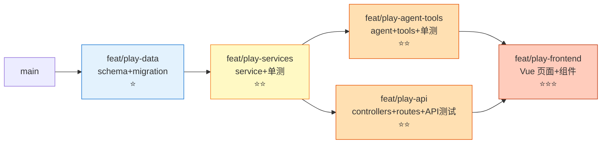

# PangHu AI 协作工作流设计

> **版本**：v1.0 ｜ **最后更新**：2026-06-18 ｜ **状态**：Phase 1 待落地后回写 v1.1
>
> **设计灵感**：参考《Claude Code 高阶并行 · Windows 实战教程》，把 4-Claude-并行的思想裁剪成"单人 + 单/双 Claude"在 PangHu 这套 Node/TS monorepo 上的可执行版本。
>
> **一句话定位**：用文档约束 LLM 改动范围、用 hooks 兜底质量、用合并顺序避免冲突、用复盘沉淀经验。
>
> **平台**:Windows 11 + PowerShell 5.1 / 7 + Git Bash 兼容
> **技术栈适配**：FastAPI/pytest → Express/vitest，ruff → tsc 增量校验（暂不引入 eslint/prettier，见 §11）
>
> **元原则**（来自附录 B.4）：**承认过去，从下一步严格起。** 别试图把"完美工作流"逆向回填到现有代码。

---

## 0. 现状盘点（设计依据）

| 维度 | 现状 | 痛点 |
|------|------|------|
| 分支模型 | `feature/agent-framework` **mega-branch**：87 文件 / 22329 行变更，混合至少 6 个独立 feature（play / 过敏 / 确认流 / 健康报告 / todo / chat 卡片重构 + k8s + 文档） | 难 review、难回滚、合并风险高；详细处理决策见 §11 附录 B.1 |
| 测试 | vitest 多 config（backend / api / coverage），fixture 在 `backend/src/__tests__/fixtures/`，**17 个测试文件**用 `beforeEach/beforeAll` | fixture 共享但无统一入口；新加 service 容易各写一套 setup |
| Lint/Format | **未安装** eslint/prettier；只有 `vue-tsc` 做 typecheck | LLM 写完代码不自动校验，但**贸然引入会一次性爆出几百个错** |
| AI 约束 | 无 CLAUDE.md，没有 Branch Contracts | LLM 容易越界改 schema、改 routes 入口 |
| 复盘 | 仅 git log，无 RETRO | 经验流失 |

> ⚠️ **关键认知**：当前 mega-branch 的状况已无法用"温柔拆分"修复。决策详见 §11 附录 B.1。

---

## 1. 总体哲学：单人 × 多任务 × LLM

```
教程原版           PangHu 改造版
─────────         ──────────────
3 工人 + 1 监工  → 1 工人会话 + 1 review 会话（按需切）
git worktree × 4 → git worktree × 1~3（只在并行需要时拉起）
pytest in-memory → vitest setupFiles + Prisma test schema
ruff hook        → tsc --noEmit + vitest --changed（Phase 1-2）
                   eslint --fix + prettier hook（Phase 3，待 baseline 后）
PostToolUse trigger → Edit|Write 时跑 tsc 增量（轻量）
3 轮 review 节奏   → 每子分支收尾跑一次 supervisor pass
RETRO.md         → docs/04-复盘/<feature>-retro.md
```

**核心原则**：
1. **每件事都有边界**——分支、目录、依赖三重边界
2. **质量门自动化**——LLM 写完不需要你提醒就跑 lint/test
3. **合并按依赖图，不按时间**——底层先合，UI 最后合
4. **复盘是投资不是负担**——固定模板降低执行成本

---

## 2. 分支拆分：把当前膨胀分支炸开

### 2.1 当前 `feature/agent-framework` 的实际拓扑

从 `git status` 反推，这个分支按"层"看大致是 4 层、按"业务 feature"看混合了 6+ 件独立工作（play / 过敏 / 确认流 / 健康报告 / todo / chat 卡片重构 + k8s + 文档）。本文以"分层视角"做后续拆分参考：

```
feature/agent-framework （当前）
├── 数据层 .................... prisma/schema, prisma/migrations
├── service 层 ................ catProfile / playFeedback / preference
├── agent 层 .................. tools/recommendPlay, tools/submitPlayFeedback, agent/recommend/*
├── 路由/控制器层 ............. controllers/play, controllers/catPlayProfile, routes/play
└── 文档 ...................... docs/01-产品 + 02-开发 + 03-设计
```

### 2.2 推荐拆分方案



**合并顺序**：`data → services → (tools ∥ api) → frontend`

每个子分支的契约见下一节。

---

## 3. Branch Contracts（写进 CLAUDE.md）

### 3.1 项目根 `CLAUDE.md` 模板

把下面这份放到 `e:\AiProject\cctest\PangHu\CLAUDE.md`（项目根，不是子目录）：

```markdown
# PangHu / 哈吉咪养成计划

## 一句话定位
喵咪养成 + 陪玩推荐的全栈应用：Express + Prisma + Vue 3 + LLM Agent。

## Monorepo 结构
- backend/        : Express + Prisma + Agent
  - src/agent/    : LLM Agent（Planner/Loop/Tools）
  - src/services/ : 业务服务层
  - src/controllers/ + src/routes/ : HTTP 入口
  - prisma/       : schema + migrations
  - src/__tests__/ : vitest 测试（按层分目录）
- frontend/       : Vue 3 + Vite + Element Plus + Pinia
- docs/           : 01-产品 / 02-开发 / 03-设计

## 启动 / 测试 / 校验（Windows PowerShell）
- 后端开发: cd backend ; npm run dev
- 前端开发: cd frontend ; npm run dev
- 后端单测: cd backend ; npm run test:unit
- 后端 API 测试: cd backend ; npm run test:api
- 前端 typecheck: cd frontend ; npm run typecheck
- DB 迁移: cd backend ; npm run db:migrate

## 编码约定
- 所有 public 函数有 type hint
- 业务进 service，controller 只做参数校验和组装
- 新增 / 修改函数必须配测试（vitest）
- 禁止 console.log；用 logger
- 密钥从 process.env 读，禁止硬编码

## 🔒 禁止改动清单（违反 = 必须 supervisor 批准）

> **优先级规则**：当前分支的 Branch Contracts 若**显式包含**禁区路径，则视为豁免（例：`feat/play-data` 可改 `prisma/schema.prisma`）。除此之外一律拦截。

- prisma/schema.prisma          # 数据契约，跨分支必经协商
- backend/src/routes/index.ts   # 路由总入口
- backend/src/agent/index.ts    # Agent 总入口
- backend/src/config/featureFlags.ts  # 特性开关
- vitest.*.config.ts            # 测试配置
- .claude/**                    # Hook 配置归 main 管
- frontend/auto-imports.d.ts / components.d.ts  # 自动生成，不要手改

## Branch Contracts（当前 sprint）

> **读 ≠ 写**：每个分支允许**只读引用**任何路径（包括禁区，用于理解类型/契约）；下面列的是**允许编辑**的路径。

- feat/play-data         : 编辑 prisma/schema.prisma + prisma/migrations/**
- feat/play-services     : 编辑 backend/src/services/{catProfile,playFeedback,preference}.service.ts
                          + backend/src/__tests__/services/**
                          + backend/src/data/**（如有静态数据）
                          只读：prisma/schema.prisma, src/types/**
- feat/play-agent-tools  : 编辑 backend/src/agent/recommend/**
                          + backend/src/agent/tools/{recommendPlay,submitPlayFeedback}.tool.ts
                          + backend/src/__tests__/agent/{recommend,tools}/**
                          只读：services/**, prisma/schema.prisma
- feat/play-api          : 编辑 backend/src/controllers/{play,catPlayProfile}.controller.ts
                          + backend/src/routes/play.routes.ts
                          + backend/src/__tests__/api/{play,catPlayProfile}.api.test.ts
                          只读：services/**, prisma/schema.prisma
- feat/play-frontend     : 编辑 frontend/src/views/play/**
                          + frontend/src/components/play/**
                          + frontend/src/stores/play.ts
                          只读：backend 产出的 OpenAPI / 类型快照（合并 tools+api 后冻结）

合并顺序：play-data → play-services → (play-agent-tools ∥ play-api) → play-frontend
> tools/api 合并完后，由 backend 一次性产出/更新一份 TS 类型快照（或 OpenAPI），供 frontend 消费，避免反复回改。

## Windows 注意（给 Claude 看）
- 平台：Windows + PowerShell（不是 bash/zsh）
- 命令分隔统一用 `;`（PS 5.1 / 7 都支持）
- `&&` / `||` 是 PS 7.0+ 才引入的管道链运算符；为兼容 PS 5.1，**约定不用**
- 文件路径在脚本里用正斜杠或 `path.join`
- 跑 npm 命令前 `cd backend` 或 `cd frontend`
```

### 3.2 子分支自携契约（可选）

如果某个子分支特别复杂，在该 worktree 根目录加 `BRANCH.md`，进一步细化"这个分支具体要做哪些 ticket、不要做哪些"。

---

## 4. Windows Hooks 配置（Node/TS 版，tsc-only 路线）

> ⚠️ **本章是 Phase 3 的预备资料**——Phase 1 / Phase 2 不需要执行任何 hook 配置，直接跳到 §5 即可。先把分支契约（CLAUDE.md）跑通，hooks 是"放大器"，分支契约+合并顺序的价值不依赖它。
>
> **设计决策**：Phase 3 hooks 走"轻量校验"路线——**不引入 eslint/prettier**（项目目前未装；贸然铺开会立刻爆几百个存量错，反而毁掉 hook 的可信度）。等未来单独开 `chore/setup-lint` 分支跑一次 baseline 后再升级。详见 §11。

### 4.1 目录结构

```
.claude/
├── settings.json                  # hook 配置（项目级）
└── scripts/
    ├── post-edit.ps1              # PostToolUse: Edit|Write 后跑 tsc 增量
    ├── guard-bash.ps1             # PreToolUse: 拦危险命令
    └── on-stop.ps1                # Stop: 跑相关测试（vitest --changed）
```

### 4.2 三个 hook 脚本要点

**post-edit.ps1**：根据文件路径分流，只跑 tsc
```powershell
# 伪代码思路
param([string]$FilePath)

# 路径分隔符归一化（Claude Code 传入可能是 / 也可能是 \）
$FilePath = $FilePath -replace '/', '\'

if ($FilePath -match '\\backend\\.*\.ts$') {
    & "$repo\backend\node_modules\.bin\tsc.cmd" --noEmit -p "$repo\backend\tsconfig.json"
}
elseif ($FilePath -match '\\frontend\\.*\.ts$') {
    # 只跑纯 TS 增量，不带 .vue（vue-tsc 冷启动 5~30s，会把 hook 拖到不可用）
    & "$repo\frontend\node_modules\.bin\tsc.cmd" --noEmit -p "$repo\frontend\tsconfig.json"
}
# .vue / .md / .json / .sql 等不在 PostToolUse 校验，留给 Stop hook 或 pre-commit
exit 0
```

> 💡 **vue-tsc 放哪？** Stop hook 或 pre-commit。理由：vue-tsc 冷启动太慢，每次 Edit 都跑会让 LLM 实际写代码时频繁卡顿。
>
> 💡 后续 lint baseline 跑通后，可以在这里追加 `eslint --fix $FilePath`。改动只是这一个脚本。

**guard-bash.ps1**：危险命令清单
```
Remove-Item -Recurse        # 防误删
prisma migrate reset        # 防 drop 数据库
git push --force            # 防强推
git reset --hard            # 配 PreToolUse 双重保险
```

**on-stop.ps1**：
- 检查 git diff 涉及哪些目录
- backend 改动 → 跑 `vitest run --config vitest.backend.config.ts --changed`
- frontend 改动（含 .vue）→ 跑 `vue-tsc --noEmit -p frontend/tsconfig.app.json`
- **永远 `exit 0`**，失败信息打 stdout

> 📌 **`vitest --changed` 语义说明**：基于 git working tree 的未提交变更（默认与 HEAD 对比），不是基于"测试缓存"。要求**仓库本身处于干净状态**（已 commit 的不会重跑）。CI 上需要换 `--changed origin/master` 之类的显式 base。

### 4.3 settings.json 关键点

参考教程 §2.4.5，把 `command` 全部用 `C:/Windows/System32/WindowsPowerShell/v1.0/powershell.exe -NoProfile -ExecutionPolicy Bypass -File ...` 包起来。**不要**期待 `$CLAUDE_FILE_PATH` 环境变量——所有数据从 stdin JSON 读（教程 §8.2.1 已踩过）。

### 4.4 Q：要不要现在就装？
**建议晚点装**（Phase 3）。重申章首横幅：先把分支契约（CLAUDE.md）跑通，hooks 是"放大器"——分支契约+合并顺序的价值不依赖它。

---

## 5. 测试隔离：vitest setupFiles 替代 conftest.py

### 5.1 教程 §6.5.3 的核心观察

> 多个测试文件各自写 fixture 处理"清状态"，互相冲突——把它们统一进**项目唯一的** fixture 入口。

### 5.2 PangHu 落地版（轻量入口，不强制迁移）

> **设计决策**：现有 17 个测试文件已用 `beforeEach/beforeAll`，多数是**合理的本地 fixture**（不同 mock prisma），**不是**教程那种"重复的 _db.clear()"。
>
> 因此**不做大重构**，只建轻量入口，新文件鼓励使用，旧文件不强制迁移。

vitest 的 `setupFiles` 等价 pytest 的 `conftest.py`。

**`backend/src/__tests__/_setup.ts`**（新建）：
```typescript
// 只做 3 件事：
// 1. 注入测试用环境变量默认值（JWT_SECRET 等）
// 2. 提供全局 mock 重置 hook（每个测试前重置）
// 3. 暴露共享 fixture 工厂函数（可选用，不强制）

import { beforeEach } from 'vitest'

// 1. 环境变量默认值
process.env.JWT_SECRET ??= 'test-secret'
process.env.NODE_ENV = 'test'

// 2. 全局重置（被 import 的 mock 会被自动应用，这里只兜底）
beforeEach(() => {
  // 例：vi.clearAllMocks() 之类
})

// 3. 公共 fixture 工厂导出（按需引入）
export { /* 例如 makeTestUser, makeTestCat 等 */ }
```

**`vitest.backend.config.ts`** 加一行（注意：该 config 位于**仓库根目录**，不是 `backend/` 内，所以下面的相对路径以仓库根为基准）：
```typescript
test: {
  // ...existing
  setupFiles: ['./backend/src/__tests__/_setup.ts'],  // ← 新增（相对仓库根）
}
```

### 5.3 时机：跟当前 mega-branch 收尾**一起做**

理由：mega-branch 反正要 review 一次大 PR，把 `_setup.ts` 加进去不会让 review 更痛苦——它就一个新文件。**单开 chore 分支没必要**——除非未来真触发了大规模迁移。

> 🔑 **不做的事**：不去改那 17 个已经在用 `beforeEach` 的测试文件。等哪天某文件因为 fixture 冲突挂了再顺手搬过去。

---

## 6. 合并顺序与冲突预案

### 6.1 五类典型冲突映射到 PangHu

| 教程冲突类型 | PangHu 对应风险 | 预防 |
|------|------|------|
| .gitignore add/add | 多分支同时改 .gitignore | 列入禁止改动清单 |
| pyproject.toml 依赖 | `backend/package.json` 依赖列表 | 取并集；新增依赖必须 supervisor 批准 |
| 同 bug 双修 | services 层和 controller 都做了相同校验 | round-2 review 必查 |
| 测试接口变更 | service 签名改了导致 controller 测试挂 | 服务先合 → controller 后合 |
| 内部 API 失效 | `_db.clear()` → PangHu 没有，但 `prisma migrate reset` / 手写 `prisma.$transaction` 清表的脚本是类似坑 | 测试隔离统一进 _setup.ts |

### 6.2 合并清单（按 §2.2 的依赖图）

```powershell
# 进入 main worktree
cd E:\AiProject\cctest\PangHu
git checkout master
git pull

# Step 1: 合 data 层（最小风险）
git merge --no-ff feat/play-data
cd backend ; npm run db:migrate ; npm run test:unit
git push

# Step 2: 合 services 层
git merge --no-ff feat/play-services
cd backend ; npm run test:unit
# 出冲突优先取 services 分支的实现

# Step 3: 并行合 tools 和 api（顺序无关，但建议先 tools）
git merge --no-ff feat/play-agent-tools
cd backend ; npm run test:unit

git merge --no-ff feat/play-api
cd backend ; npm run test:api

# Step 4: 最后合 frontend
git merge --no-ff feat/play-frontend
cd frontend ; npm run typecheck
```

每一步合并完**先跑测试再 commit**（教程 §6.5 的核心教训）。

### 6.3 并行期间 Prisma schema 跨 worktree 同步

**问题**：`feat/play-data` 还没合 master 时，`feat/play-services` 的 worktree 怎么用到最新 schema？如果 services 从 master fork，会缺字段；硬拷贝 `schema.prisma` 又违反契约。

**推荐做法**（按优先级）：

1. **services 从 data 分支 fork，不从 master fork**

   ```powershell
   git worktree add ../panghu-services feat/play-services feat/play-data
   ```

   data 合并 master 后，services rebase 一次 master 即可消化。

2. **如果 data 仍在频繁变动**：services worktree 里跑

   ```powershell
   git fetch origin feat/play-data
   git merge --no-commit --no-ff origin/feat/play-data -- prisma/schema.prisma
   ```

   只取 schema 文件，不污染其他历史。**仅本地用，不要 push**。

3. **绝对禁止**：在 services 分支里直接编辑 `prisma/schema.prisma`——这是禁止改动清单 + 违反 Branch Contracts 双重越界。

合并完 data → master 后，所有兄弟 worktree 必须 rebase / merge master 一次再继续干活。

---

## 7. RETRO 模板（每个 feature 收尾必填）

新建目录：`docs/04-复盘/`

模板文件：`docs/04-复盘/_template.md`

```markdown
# <Feature 名称> Retro

**日期**：YYYY-MM-DD
**分支**：feat/xxx → master
**耗时**：X 小时（含 review）

## 一、Sprint 设置
- 拆分了哪些子分支
- LLM 角色分工（工人会话 / review 会话）
- 关键约束（CLAUDE.md / Branch Contracts 哪几条）

## 二、最终结果
- 测试结果（X passed, Y failed）
- merge graph 截图或 git log --graph 摘要

## 三、What Worked（≤5 条）

## 四、What Hurt（≤5 条）

## 五、合并冲突案例
| 文件 | 冲突类型 | 处理 |
|------|---------|------|

## 六、Numbers
- 总 commits：
- 新增 / 删除行：
- 测试新增条数：
- supervisor must-fix 数 / 采纳数：
- **LLM 越界尝试次数 / 被 hook 拦下次数 / 漏网次数**：
- **越界类型 Top 3**（如：擅改 schema、动 routes/index.ts、自加 npm 依赖）：

## 七、Action Items（≤3 条，重复出现 2 次以上的反哺回 CLAUDE.md）
- [ ]
- [ ]
- [ ]
```

---

## 8. 落地路线图（按收益/成本排序）

> 已确认决策（详见 §11）：
> - Q1 当前 mega-branch → **A 接受现状**，整体合 master，从下个 feature 起严格
> - Q2 vitest setupFiles → **轻量入口**，跟 mega-branch 收尾一起加，不强制迁移
> - Q3 Hooks lint → **A tsc-only**，暂不引入 eslint/prettier

### Phase 1 ⭐ 当前 mega-branch 收尾（立刻做）

- [ ] 把 allergy / todo 的 raw SQL 补成正式 prisma migration
- [ ] 写项目根 `CLAUDE.md`（§3.1 模板，含 Branch Contracts + 禁止改动清单）
- [ ] 加 `backend/src/__tests__/_setup.ts`（轻量版，§5.2）
- [ ] `vitest.backend.config.ts` 加 `setupFiles`
- [ ] 跑全量测试验证不破坏现有 17 个测试文件
  - **回滚预案**：若任一旧测试因 `_setup.ts` 失败，立刻 `git revert` `_setup.ts` 与 config 改动，单开 issue 排查（**不阻塞 mega-branch 合并**）
- [ ] 整体合 master（squash 或 merge --no-ff 你定）
- [ ] **关键**：在 CLAUDE.md 里写明"分支契约自 YYYY-MM-DD 起生效，之前不追溯"

### Phase 2 ⭐⭐ 下一个 feature 启动前（严格执行新规矩）

- [ ] 在 `docs/04-复盘/` 建目录 + 放 RETRO 模板（§7）
- [ ] 写该 feature 专属的 Branch Contracts（在 CLAUDE.md 追加段落）
- [ ] 按依赖图拆子分支（参考 §2.2 拓扑思想）
- [ ] 每个子分支只动 contract 允许的目录
- [ ] 按 §6.2 顺序合并，每步先测后 commit
- [ ] feature 收尾写 RETRO

### Phase 3 ⭐⭐⭐ 合适时机单独开 chore 分支

- [ ] `chore/setup-lint`：装 eslint + prettier，跑一次 baseline `--fix`，commit "lint baseline"
- [ ] 升级 `post-edit.ps1`：在 tsc 后追加 `eslint --fix`
- [ ] 配 Windows hooks（§4，参考教程 §2.4）
- [ ] 加用户级统计 hook（教程 §8.2，跨项目度量 ROI）

### Phase 4 ⭐⭐⭐⭐ 长期演进

- [ ] CI 强制：PR 必须有 RETRO 链接 + 测试全绿才能 merge
- [ ] 自动化 supervisor pass：脚本检查 `git diff --stat master..` 有没有越界改 §3.1 禁止改动清单
- [ ] 把 RETRO 反复出现的 Action Item 反哺回 CLAUDE.md

---

## 9. 与教程不同的地方（设计决策记录）

| 教程做法 | PangHu 做法 | 为什么改 |
|---------|------------|---------|
| 4 个 Claude 同时跑 | 1 工人 + 按需 review 会话 | 单人开发不需要 4 个并发 LLM；多 session 注意力 + 费用都是开销 |
| pytest + conftest.py | vitest + setupFiles | 技术栈现实 |
| ruff format/check | tsc 增量（Phase 1-2）→ 未来才上 eslint+prettier | 项目目前未装 lint；贸然铺开会爆几百个存量错（详见 §11） |
| ./taskflow.db SQLite 文件锁 | Prisma + 测试 schema 或 mock | 你已经在用 Prisma，没必要回到裸 SQLite |
| Stop hook 跑全量 pytest | Stop hook 用 `--changed` 增量跑 | vitest 大全量在 monorepo 上太慢 |
| BurntToast 通知 | 暂不加（先把基线跑稳） | YAGNI |
| `gh pr create` 流 | 本地 merge 流（除非已有 GitHub remote） | 教程 §6 的"选项 A" |

---

## 10. 一页纸速查（贴到工作区）

```
启动新 feature 的检查清单：
  □ CLAUDE.md 的 Branch Contracts 段更新到当前 feature
  □ 拆好子分支，每个分支只动 contract 允许的目录
  □ 合并顺序：data → services → (tools ∥ api) → frontend
  □ 每步合并完先 npm test 再 commit
  □ feature 完成 → 写 docs/04-复盘/<feature>-retro.md

LLM 越界的红旗：
  ! 主动改 prisma/schema.prisma（除非是 feat/play-data 分支）
  ! 主动改 routes/index.ts 或 agent/index.ts
  ! 主动加 npm 依赖（必须 supervisor 批准）
  ! 跑 prisma migrate reset / git push --force / Remove-Item -Recurse
```

---

## 附录 A：参考来源

- 《Claude Code 高阶并行 · Windows 实战教程》(v3 合并实战修订版)
  - §2.4 hook 配置 → 本文 §4
  - §6.5 合并冲突五类模板 → 本文 §6
  - §6.5.3 conftest.py → 本文 §5
  - §7.1 RETRO 模板 → 本文 §7
  - §8.2 统计 hook → 本文 Phase 3

## 附录 B：决策记录（曾经的未决问题，现已拍板）

> 设计 v1 留了 3 个未决点，对照项目实际数据后做出如下决策。

### B.1 当前 mega-branch 怎么办？ → **A 接受现状**

**调查发现**：`feature/agent-framework` 实际是 87 文件 / 22329 行变更的 mega-branch，混合了 6+ 个独立 feature（play / 过敏 / 确认流 / 健康报告 / todo / chat 卡片重构 + k8s + 文档）。

**选项与决策**：

| 选项 | 说明 | 决策 |
| ------ | ------ | ------ |
| A 接受现状 | 整体合 master，从下个 feature 起严格 | ✅ 选 A |
| B 强行拆分 | cherry-pick 重组成 6 个 feature 分支 | ❌ commit 已交错，成本远超收益 |
| C 半路开始 | 收尾时写归一化 RETRO | ❌ 多此一举，留给 Phase 2 第一个 RETRO 即可 |

**关键约束**：CLAUDE.md 必须写明"分支契约自 YYYY-MM-DD 起生效，之前不追溯"。

### B.2 vitest setupFiles 何时做？ → **轻量入口，跟 mega-branch 收尾一起加**

**调查发现**：现有 17 个测试文件用 `beforeEach/beforeAll`，多数是合理的本地 fixture（不同 mock prisma），不是教程那种"重复的 `_db.clear()`"。

**决策**：

- ✅ 加 `backend/src/__tests__/_setup.ts` 轻量入口（环境变量默认值 + 全局 mock 重置 + 共享 fixture 工厂）
- ✅ `vitest.backend.config.ts` 加 `setupFiles`
- ❌ **不强制迁移已有 17 个测试**（等触发冲突再顺手搬）
- ✅ 跟 mega-branch 收尾一起加（反正要 review 一次大 PR），不单开 chore 分支

### B.3 Hooks 用哪个 lint？ → **A 只用 tsc**

**调查发现**：项目未安装 eslint/prettier。如果现在装一套完整规则集，会立刻在已有代码里爆出几百个错——hook 满屏红，会让你对 hook 失去信任。

**选项与决策**：

| 选项 | 命令 | 决策 |
| ------ | ------ | ------ |
| A 只用 tsc | `tsc --noEmit` 增量 + `vitest run --changed` | ✅ 选 A |
| B 最小 eslint | 只开 no-unused-vars / no-undef | ❌ 仍会有噪音 |
| C 完整 eslint + prettier | airbnb / vue 推荐配置 | ❌ 一上来满屏红 |

**未来升级路径**：等专门开 `chore/setup-lint` 分支跑一次 baseline `--fix` commit "lint baseline"后，再把 lint 加入 hook（详见 §8 Phase 3）。

### B.4 三个决策的内在一致性

> **"承认过去，从下一步严格起。"**
>
> - B.1：不强行拆 mega-branch（承认过去）+ 下次起严格契约（从下一步严格）
> - B.2：不强制迁移 17 个测试（承认过去）+ 新文件用 `_setup.ts`（从下一步严格）
> - B.3：不一次性铺开 eslint（承认过去）+ 先 tsc 兜底，专门分支再升级（从下一步严格）
>
> 反面（**不**推荐）：试图把"完美工作流"逆向回填到现有代码——会陷入"清理 → 又被 LLM 弄乱 → 再清理"的循环。
